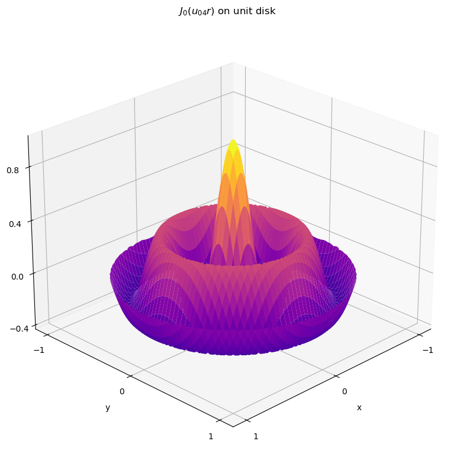

# Advanced Engineering Mathematics

## Introduction

While preparing for qualifying exams, I've produced a pile of notes sourced from the Advanced Engineering Mathematics book by E. Kreyszig.
For reusability, I tried to compactly summarize key topics on a single page, including Linear Algebra, ODEs, PDEs, Laplace Transforms, and Vector Analysis.
Although math is best learned through proofs, these notes may be useful for readers who already have familiarity with the concepts or who are looking for a relevant roadmap.

To make it more accessible, I converted handwritten notes to LaTeX using Claude.

If you want to contribute, feel free to update the tex files and open a pull request; otherwise, enjoy!

---

## Files

- **main.tex**  
  Main LaTeX source that compiles the full document.

- **pages/**  
  Individual LaTeX sections included in `main.tex`.

- **figures/**  
  Figures and plots used throughout the notes.

- **Math_notes.pdf**  
  Compiled PDF version of the notes.

- **plots.ipynb**  
  Jupyter notebook used to generate plots.

- **prompt.txt**  
  Prompt used during LaTeX conversion with Claude.

---

## Usage & Sharing

- Intended for personal and academic use.
- Must not be redistributed, republished, or reshared without proper reference to this repository and the original author.

---

## References

- Advanced Engineering Mathematics — E. Kreyszig et al. (2008)
- Lectures by Prof. Kamy Sepehrnoori (PGE 381K)

---

## Author

**Dursun Dashdamirov**  
PhD student at UT Austin
